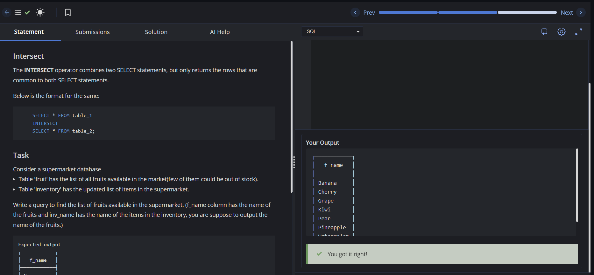

# Experiment 2 - Task 3

Name: ARUSHI GARG

UID: 24BCS11147

## Aim

Use the `INTERSECT` operator to identify fruits that are both listed in the `fruit` table and present in the `inventory` table.

## Question

Given a supermarket database where the `fruit` table lists all fruits and the `inventory` table lists current inventory items, write a query to return fruit names (`f_name`) that also appear in `inventory` (`inv_name`).

## SQL Queries Used

### Find Common Fruits

```sql
/* Write a query to find the list of fruits available in the supermarket.
(f_name column has the name of the fruits and inv_name has the name of inventories, you are suppose to output the name of the fruits.)*/
SELECT f_name FROM fruit
INTERSECT
SELECT inv_name FROM inventory;
```

## Output

```text
┌────────────┐
│   f_name   │
├────────────┤
│ Banana     │
│ Cherry     │
│ Grape      │
│ Kiwi       │
│ Pear       │
│ Pineapple  │
│ Watermelon │
└────────────┘
```

## Output Screenshot



## Image Explanation

Screenshot shows the `INTERSECT` query result listing fruits present in both `fruit` and `inventory`, confirming the query's correctness.

## Result

The list of available fruits was retrieved successfully using INTERSECT.