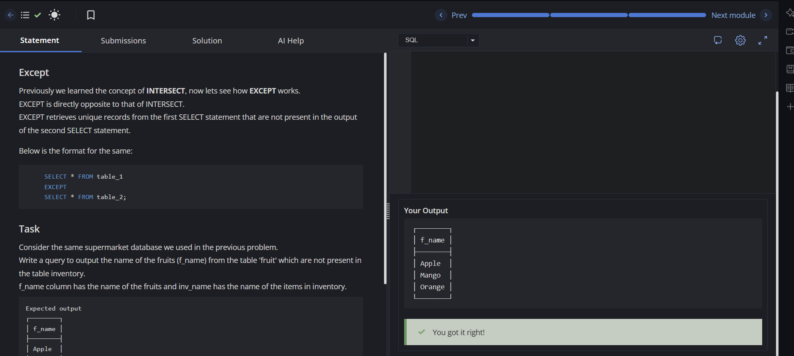

# Experiment 2 - Task 4

Name: ARUSHI GARG

UID: 24BCS11147

## Aim

Use the `EXCEPT` operator to return fruit names that appear in the `fruit` table but are missing from the `inventory` table.

## Question

Given the same supermarket database, write a query to list fruit names (`f_name`) from the `fruit` table that do not appear in the `inventory` table (`inv_name`).

## SQL Queries Used

### Find Fruits Not Present in Inventory

```sql
/* Write a query to output the name of the fruits (f_name) from the table 'fruit' which are not present in the table inventory(f_name column has the name of the fruits and inv_name has the name of the items in inventory). */

SELECT f_name FROM fruit
EXCEPT
SELECT inv_name FROM inventory;
```

## Output

```text
┌────────┐
│ f_name │
├────────┤
│ Apple  │
│ Mango  │
│ Orange │
└────────┘
```

## Output Screenshot



## Image Explanation

The screenshot shows the EXCEPT query executed in the SQL editor. The output contains only the fruits that are in the fruit table but missing from the inventory table, which matches the task requirement.

## Result

The fruits not present in the inventory table were retrieved successfully using EXCEPT.