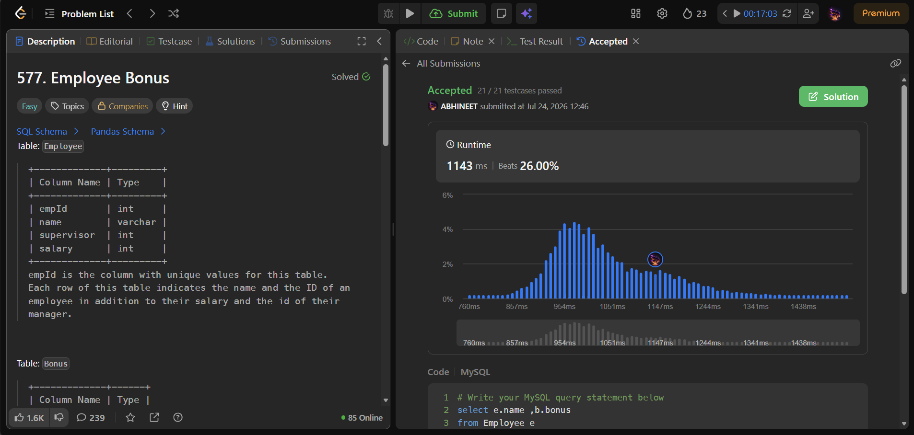

# Experiment 3 - Task 4

Name: ARUSHI GARG

UID: 24BCS11147

## Aim

List employees who either received a bonus below 1000 or who have no bonus record.

## Question

Write a query that returns each employee's name and bonus amount where the bonus is less than 1000 or the bonus is NULL (no bonus recorded).

## SQL Queries Used

### Find employees with bonus less than 1000 or no bonus

```sql
SELECT e.name, b.bonus
FROM Employee e
LEFT JOIN Bonus b
ON e.empId = b.empId
WHERE b.bonus < 1000 OR b.bonus IS NULL;
```

## Output

```text
+------+-------+
| name | bonus |
+------+-------+
| Brad | null  |
| John | null  |
| Dan  | 500   |
+------+-------+
```

## Output Screenshot



## Image Explanation

Screenshot shows the `LEFT JOIN` between `Employee` and `Bonus`, filtered for `bonus < 1000` or `NULL`, yielding the requested names and bonus values.

## Result

The query returns employees with bonuses below 1000 and those without bonus records as intended.

