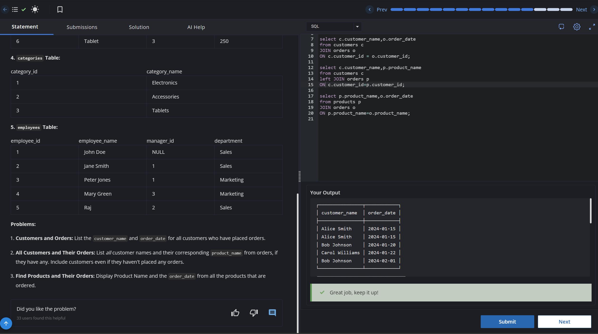

# Experiment 4 - Task 1

Name: ARUSHI GARG

UID: 24BCS11147

## Aim

Retrieve customer names together with their order dates for customers who have placed orders (inner join).

## Question

Write a query that joins `customers` and `orders` on `customer_id` and returns the customer's name and the corresponding `order_date`.

## SQL Queries Used

```sql
select c.customer_name,o.order_date
from customers c
JOIN orders o
ON c.customer_id = o.customer_id;
```

## Output

```text
Returns matching customer and order records from `customers` and `orders`.
```

## Output Screenshot



## Image Explanation

Screenshot shows the inner join result combining `customers` with their `orders` records.

## Result

The join query successfully returns customer names paired with their order dates.
