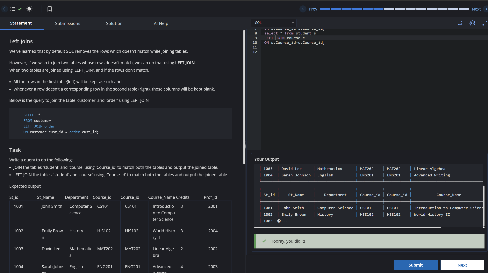

# Experiment 4 - Task 2

Name: ARUSHI GARG

UID: 24BCS11147

## Aim

List every customer along with the product name of their order, including customers who have not placed orders (use `LEFT JOIN`).

## Question

Write a query that returns `customer_name` and `product_name` by left-joining `customers` with `orders`, ensuring customers without orders are still shown.

## SQL Queries Used

```sql
select c.customer_name,p.product_name
from customers c 
left JOIN orders p
ON c.customer_id=p.customer_id;
```

## Output

```text
Returns every customer and the product name for their order when present; otherwise product_name is NULL.
```

## Output Screenshot



## Image Explanation

Screenshot demonstrates the `LEFT JOIN` preserving all customers while showing product names only for matching orders.

## Result

The query returns all customers with order product names where applicable.
