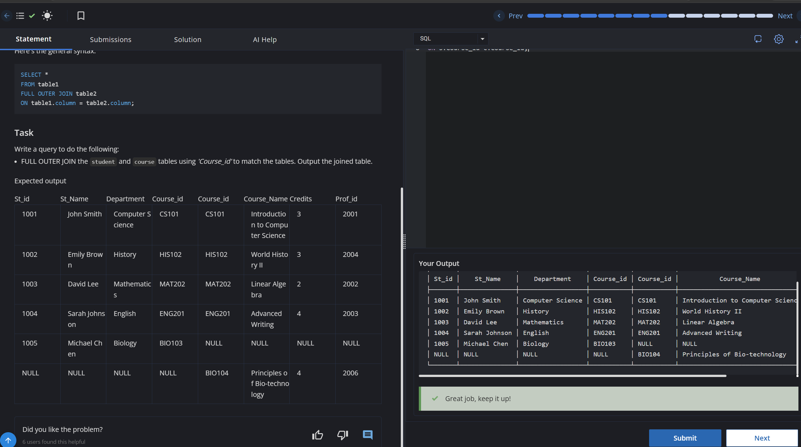

# Experiment 4 - Task 4

Name: ARUSHI GARG

UID: 24BCS11147

## Aim

Perform an `INNER JOIN` between `student` and `course` using `Course_id` to combine matching records.

## Question

Write a query that joins `student` with `course` on `Course_id` and returns the combined rows for matching entries.

## SQL Queries Used

```sql
select * from student s
JOIN course c
ON s.Course_id=c.Course_id;
```

## Output

```text
Returns rows from `student` and `course` where `Course_id` matches in both tables.
```

## Output Screenshot



## Image Explanation

Screenshot shows the inner join result where students are paired with matching course records by `Course_id`.

## Result

The join query returns combined student and course records for matching `Course_id` values.
