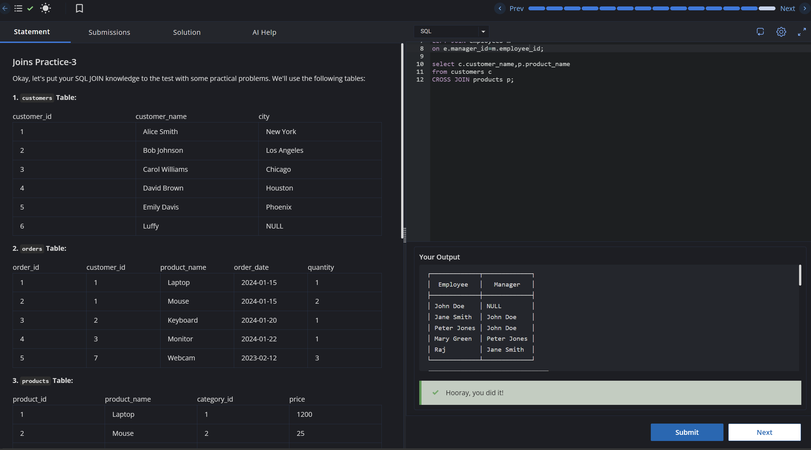

# Experiment 4 - Task 5

Name: ARUSHI GARG

UID: 24BCS11147

## Aim

Use a `LEFT JOIN` to combine `student` with `course`, ensuring every student record is included even if no course match exists.

## Question

Write a query that left-joins `student` to `course` on `Course_id` and returns all student rows with matching course details where available.

## SQL Queries Used

```sql
select * from student s
LEFT JOIN course c
ON s.Course_id=c.Course_id;
```

## Output

```text
Returns all student rows with matching course details where available; unmatched course fields appear as NULL.
```

## Output Screenshot



## Image Explanation

Screenshot demonstrates the `LEFT JOIN` preserving all students while showing course details when present.

## Result

The query returns all students together with course information when available.
