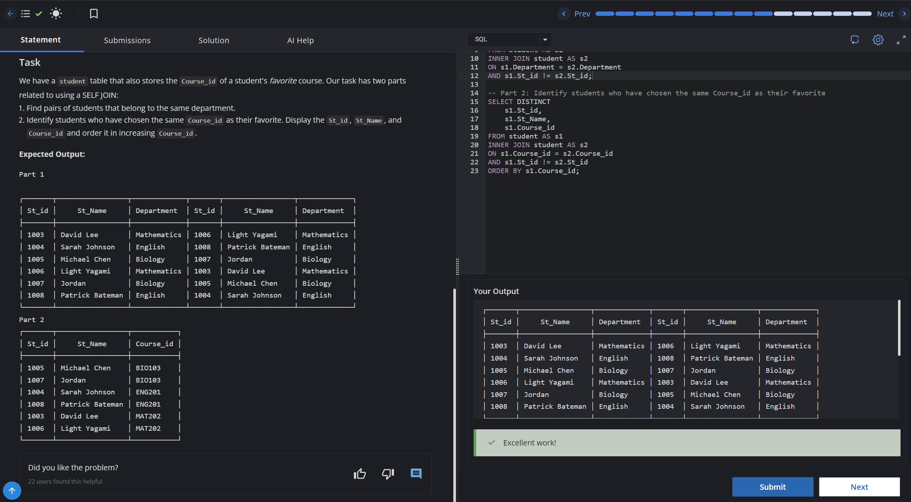

# Experiment 4 - Task 6

Name: ARUSHI GARG

UID: 24BCS11147

## Aim

Retrieve all orders along with their associated customer details.

## Question

Write a query that joins `customers` and `orders` on `customer_id` and returns each order with the customer's name and order fields.

## SQL Queries Used

```sql
select c.customer_name,o.order_id,o.customer_id,o.product_name,o.order_date,o.quantity
from customers c
JOIN orders o 
ON c.customer_id=o.customer_id;
```

## Output

```text
Returns each order together with its associated customer information.
```

## Output Screenshot



## Image Explanation

Screenshot shows orders joined with customer details, confirming each order is paired with the corresponding customer.

## Result

The join returns orders with their related customer information as expected.
