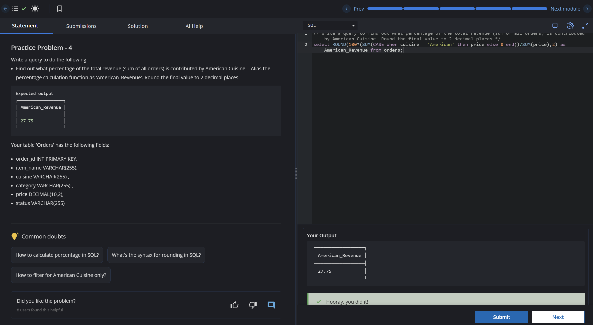

# Experiment 5 - Task 1

Name: ARUSHI GARG

UID: 24BCS11147

## Aim

Calculate the percentage of total revenue generated by orders with `cuisine = 'American'`.

## Question

Write a query that computes American cuisine revenue as a percentage of total revenue and rounds the result to two decimal places (alias as `American_Revenue`).

## SQL Queries Used

```sql
select ROUND(100*(SUM(CASE When cuisine = 'American' then price else 0 end))/SUM(price),2) as American_Revenue from orders;
```

## Output

```text
Returns the percentage of total revenue contributed by American cuisine, rounded to two decimals.
```

## Output Screenshot



## Image Explanation

Screenshot shows the rounded percentage value representing American cuisine revenue as a share of total order revenue.

## Result

The query computes the American cuisine revenue percentage and rounds it to two decimal places.
