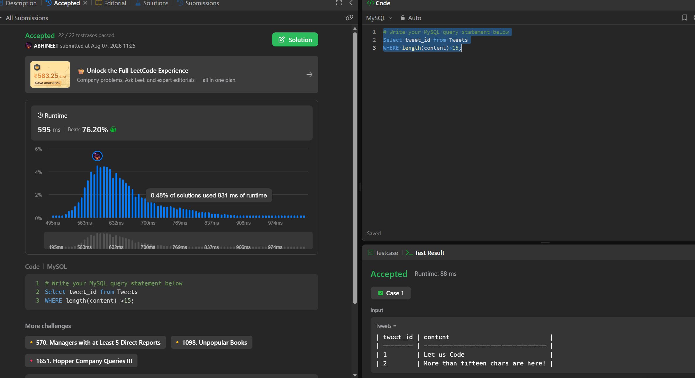

# Experiment 5 - Task 3

Name: ARUSHI GARG

UID: 24BCS11147

## Aim

Return tweet IDs for tweets whose `content` length exceeds 15 characters.

## Question

Write a MySQL query that selects `tweet_id` from `Tweets` where `LENGTH(content) > 15`.

## SQL Queries Used

```sql
# Write your MySQL query statement below
Select tweet_id from Tweets
WHERE length(content)>15;
```

## Output

```text
Returns `tweet_id` values for tweets with `content` longer than 15 characters.
```

## Output Screenshot



## Image Explanation

Screenshot shows the query filtering tweets by `LENGTH(content) > 15` and returning matching `tweet_id` values.

## Result

The query correctly returns tweet IDs for content longer than 15 characters.
