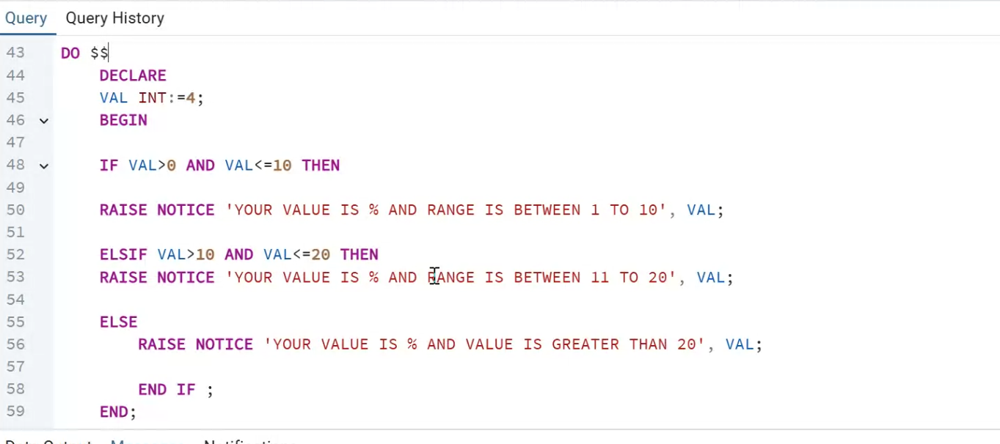

# Experiment 5 - Task 3

Name: ARUSHI GARG

UID: 24BCS11147

## Aim

Use a PL/pgSQL `DO` block with conditional statements to determine which range a numeric value falls into.

## Question

Write a PL/pgSQL `DO` block that checks the value of `VAL` and prints a notice indicating whether it is between 1 and 10, between 11 and 20, or greater than 20.

## SQL Queries Used

```sql
DO $$
DECLARE
    VAL INT := 4;
BEGIN
    IF VAL > 0 AND VAL <= 10 THEN
        RAISE NOTICE 'YOUR VALUE IS % AND RANGE IS BETWEEN 1 TO 10', VAL;
    ELSIF VAL > 10 AND VAL <= 20 THEN
        RAISE NOTICE 'YOUR VALUE IS % AND RANGE IS BETWEEN 11 TO 20', VAL;
    ELSE
        RAISE NOTICE 'YOUR VALUE IS % AND VALUE IS GREATER THAN 20', VAL;
    END IF;
END;
$$;
```

## Output

```text
YOUR VALUE IS 4 AND RANGE IS BETWEEN 1 TO 10
```

## Output Screenshot



## Image Explanation

The screenshot shows a PL/pgSQL DO block with a declared integer value of 4. The IF statement checks the range of the value and displays the matching notice message for the 1 to 10 range.

## Result

The number was successfully classified using conditional logic, and the appropriate notice message was displayed.
