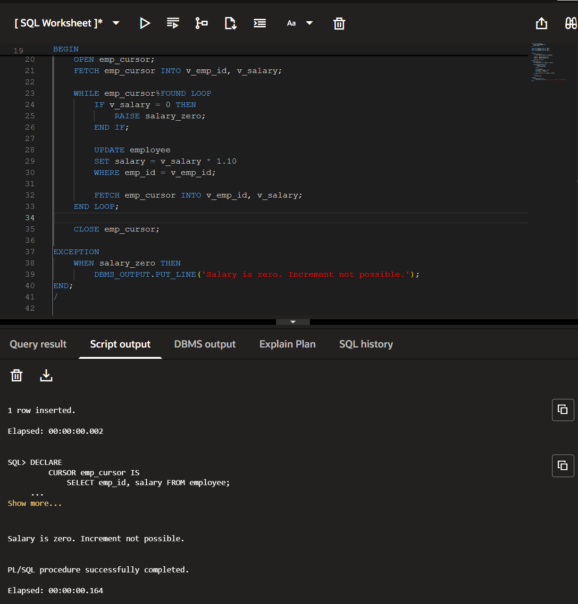

Experiment 7 - Task 1
Name: ARUSHI

UID: 24BCS11147

Aim
To use an explicit cursor and a user-defined exception in PL/SQL to handle an employee with zero salary.

Question
Create an employee table and insert employee records. Use an explicit cursor to increase each employee's salary by 10%. If an employee's salary is zero, raise a user-defined exception and display an appropriate message.

SQL Queries Used
CREATE TABLE employee (
    emp_id NUMBER PRIMARY KEY,
    salary NUMBER
);

INSERT INTO employee VALUES (1, 5000);
INSERT INTO employee VALUES (2, 0);
INSERT INTO employee VALUES (3, 7000);

DECLARE
    CURSOR emp_cursor IS
        SELECT emp_id, salary FROM employee;

    v_emp_id   employee.emp_id%TYPE;
    v_salary   employee.salary%TYPE;

    salary_zero EXCEPTION;
BEGIN
    OPEN emp_cursor;
    FETCH emp_cursor INTO v_emp_id, v_salary;

    WHILE emp_cursor%FOUND LOOP
        IF v_salary = 0 THEN
            RAISE salary_zero;
        END IF;

        UPDATE employee
        SET salary = v_salary * 1.10
        WHERE emp_id = v_emp_id;

        FETCH emp_cursor INTO v_emp_id, v_salary;
    END LOOP;

    CLOSE emp_cursor;

EXCEPTION
    WHEN salary_zero THEN
        DBMS_OUTPUT.PUT_LINE('Salary is zero. Increment not possible.');
END;
/

Output
Salary is zero. Increment not possible.

PL/SQL procedure successfully completed.

Output Screenshot

Image Explanation
The screenshot shows an explicit cursor fetching employee IDs and salaries from the employee table. The cursor increases salaries by 10% until it encounters employee 2, whose salary is zero. The user-defined salary_zero exception is raised, and the message Salary is zero. Increment not possible. is displayed.

Result
The explicit cursor successfully processed the employee records, and the user-defined exception handled the zero-salary condition by displaying the appropriate message.
