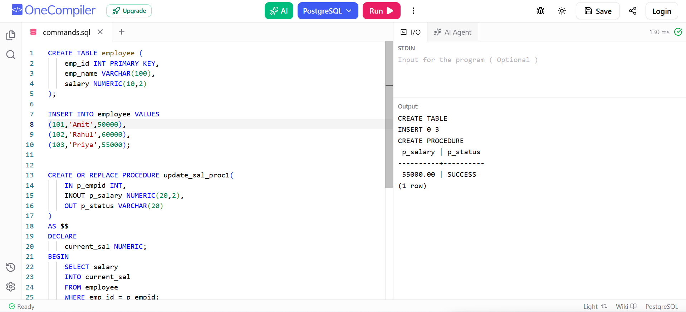

# Experiment 6 - Task 2

Name: Arushi

UID: 24BCS11147

## Aim

To create a PostgreSQL stored procedure using `IN`, `INOUT`, and `OUT`
parameters to update an employee's salary and return the operation
status.

## Question

Create an `employee` table, insert employee records, and create a stored
procedure that accepts an employee ID and salary amount. The procedure
should add the given amount to the employee's current salary, update the
employee record, and return a status message. If the employee does not
exist, the procedure should raise an exception.

## SQL Queries Used

``` sql
CREATE TABLE employee ( 
    emp_id INT PRIMARY KEY, 
    emp_name VARCHAR(100), 
    salary NUMERIC(10,2) 
); 

INSERT INTO employee VALUES 
(101,'Amit',50000), 
(102,'Rahul',60000), 
(103,'Priya',55000); 

CREATE OR REPLACE PROCEDURE update_sal_proc1( 
    IN p_empid INT, 
    INOUT p_salary NUMERIC(20,2), 
    OUT p_status VARCHAR(20) 
) 
AS $$ 
DECLARE 
    current_sal NUMERIC; 
BEGIN 
    SELECT salary 
    INTO current_sal 
    FROM employee 
    WHERE emp_id = p_empid; 

    IF NOT FOUND THEN 
        p_status := 'Employee Not Found'; 
        RAISE EXCEPTION 'Employee Not Found'; 
    END IF; 

    p_salary := current_sal + p_salary; 

    UPDATE employee 
    SET salary = p_salary 
    WHERE emp_id = p_empid; 

    p_status := 'SUCCESS'; 
END; 
$$ LANGUAGE plpgsql; 

CALL update_sal_proc1(101, 5000, NULL);
```

## Output

``` text
CREATE TABLE
INSERT 0 3
CREATE PROCEDURE

 p_salary | p_status
----------+----------
 55000.00 | SUCCESS
(1 row)
```

## Output Screenshot



## Image Explanation

The screenshot shows the successful creation of the `employee` table and
insertion of three employee records. The stored procedure
`update_sal_proc1` is then created successfully.

The procedure is called with employee ID `101` and an increment of
`5000`. Employee `101` initially has a salary of `50000`, so the
procedure updates the salary to `55000.00`. The output status is
`SUCCESS`.

## Result

The PostgreSQL stored procedure was successfully created and executed.
The salary of employee `101` was increased from `50000` to `55000`, and
the procedure returned the status `SUCCESS`.
